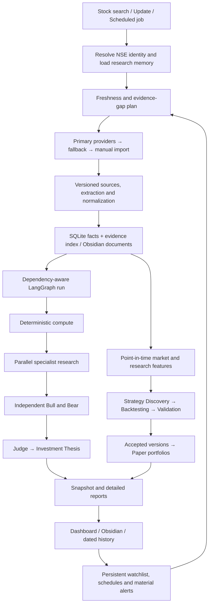

# graph_stock — Consolidated specification

Version 1.2 · 12 September 2026 · Confirmed design baseline plus authorized real-directory discovery extension

## Problem statement

Researching an NSE company currently requires repeated collection of filings, financial calculations, ownership comparisons and manual synthesis. Research becomes stale, management promises lose their history, and swing-trading ideas can look convincing without reliable historical validation. The user needs one persistent local research system that connects evidence, fundamental analysis and simulated trading.

## Solution

Enter an NSE stock such as HAL. The system retrieves existing Obsidian research, checks freshness, acquires available public evidence, computes metrics, runs only affected agents, and returns a compact investor snapshot. Detailed evidence and research remain accessible in Obsidian; structured records and operational state live in SQLite. Validated strategies run with simulated capital and update over time.

This specification preserves Q1–Q43 from the recovered decision record. Explicit choices override earlier recommendations. In particular, V1 uses **NSE only and SQLite only**. Technical details below elaborate those choices; proposed defaults are labelled and are not retroactively attributed to the user.

## User stories

1. As the researcher, I want to enter an NSE ticker or company name so that I can start research without assembling a document pack.
2. As the researcher, I want existing research retrieved first so that completed work is reused.
3. As the researcher, I want public-source fetching with manual import fallback so that inaccessible sources do not stop all research.
4. As the researcher, I want every material claim and number linked to evidence so that I can inspect its basis.
5. As the researcher, I want deterministic financial calculations so that narrative generation cannot change arithmetic.
6. As the researcher, I want business, moat, management, industry and competitor analysis so that the investment view covers more than ratios.
7. As the researcher, I want management promises compared with later results so that credibility has a historical record.
8. As the researcher, I want earnings, valuation and risk analysis refreshed after relevant events so that the thesis stays current.
9. As the researcher, I want aggregate ownership, named shareholders and mutual-fund scheme histories so that I can inspect accumulation and exits.
10. As the researcher, I want independent bull and bear cases judged against shared evidence so that the thesis is challenged.
11. As the researcher, I want category scores and an overall score with visible evidence so that summaries remain inspectable.
12. As the researcher, I want missing evidence and confidence shown separately so that incomplete research is obvious.
13. As the researcher, I want a compact snapshot and links to detailed Obsidian reports so that daily use stays simple.
14. As the researcher, I want a current thesis and dated snapshots so that I can see what changed.
15. As the researcher, I want corrections recorded with old values and reasons so that history remains auditable.
16. As the researcher, I want only affected agents rerun so that updates conserve time and reasoning capacity.
17. As the researcher, I want parallel execution where dependencies allow and recovery after interruption so that work is efficient and resumable.
18. As the researcher, I want historical strategies to use only information available then so that future disclosures cannot inflate results.
19. As the researcher, I want controlled variations of approved strategy families so that exploration stays bounded.
20. As the researcher, I want out-of-sample, walk-forward, costs, slippage and robustness checks before paper trading so that weak tests do not become active strategies.
21. As the researcher, I want both independent strategy portfolios and a combined portfolio so that strategy quality and portfolio interaction are visible.
22. As the researcher, I want simulated signals and fills to update from new market data so that paper performance accumulates honestly.
23. As the researcher, I want a persistent watchlist with daily, monthly and quarterly refreshes so that research stays useful.
24. As the researcher, I want material alerts in the dashboard and Obsidian with configurable severity so that routine noise stays low.
25. As the researcher, I want provider outages, stale prices and reasoning pauses visible so that I know what needs attention.
26. As the maintainer, I want suggested GitHub improvements tested separately and approved before integration so that external updates cannot silently change the system.
27. As the maintainer, I want strong correctness tests and reproducible run records so that changes can be trusted.
28. As the user, I want local operation with authenticated ChatGPT/Codex reasoning and no required OpenAI API key or large local model.
29. As the researcher, I want NSE candidate discovery in Phase 2 so that the initial usable release stays focused.

## Implementation decisions

### S01 — Scope, terminology and success

V1 is a local, single-user NSE equity research application: Python + FastAPI, LangGraph, React + Vite, SQLite and an Obsidian vault. Design component boundaries for possible cloud deployment later. “Local” describes the application and storage; public-source fetching and authenticated reasoning use network services.

A company is the researched legal entity; a security is its listed instrument with effective-dated symbol/ISIN mappings. A source is a versioned document or provider response. Evidence is a located excerpt or fact tied to that source. A research run is a versioned analysis of a defined evidence set. A strategy version is an immutable rule configuration. A signal is a decision at a timestamp; a paper fill is a later simulated execution.

V1 success: a real NSE ticker progresses through acquisition, memory, core analysis, compact reporting, valid historical testing, paper signal handling and incremental refresh. Every named role has a bounded responsibility; first usability does not require exhaustive sophistication in every agent. Core V1 tickets below implement baseline coverage of all frozen roles. NSE-wide discovery is Phase 2.

### S02 — Complete workflow

The diagram shows data flow, not a requirement to wait for unrelated branches. Existing validated paper strategies can consume fresh prices while new research waits for reasoning. Strategy discovery that uses research features waits for those specific inputs. A report may be partial but must never present a pending branch as completed.

First request creates a persistent watchlist entry after successful identity resolution. Ambiguous names require selection; unsupported or unknown symbols produce a clear error. Refresh compares source hashes, publication times and freshness policies before rerunning work. Return the last snapshot promptly with its timestamp and current refresh status.

### S03 — Sources, acquisition and provenance

Use primary sources first: NSE and company disclosures, annual reports, SEBI and AMFI where relevant. Trusted secondary providers supply documented fallbacks; news/web support interpretation. This hierarchy does not promise that one website supplies every required dataset.

Each adapter advertises data types, covered periods, access requirements and historical limitations. Fetch results distinguish success, unchanged, partial, unavailable, rate-limited and invalid data. Preserve raw responses/documents and their hashes; normalize only validated records. Retry transient errors with bounded backoff. Manual imports use the same validation and provenance pipeline.

Required coverage: security identity, filings/results, annual reports, corporate actions, daily OHLCV, benchmark/sector series where available, shareholding and promoter pledge, named holders, MF scheme disclosures, news/catalysts. Provider selection and representative retrieval must be demonstrated during implementation; no commercial subscription is presumed.

Evidence references carry source ID/version, URL or manual-file origin, document date, public availability time, retrieval time, page/table/section locator, extraction version and relevant text/value. Distinguish source assertions, calculated facts and agent inferences. Unresolved conflicts retain both candidates and the selection reason. Missing values are null with reasons, never fabricated zeroes.

### S04 — Storage, retrieval and version history

SQLite is the sole V1 database, including checkpoints and schedules. Obsidian holds qualitative research, extracted document text, original document attachments, thesis, agent reports, management claim narratives, industry/competitor notes, alerts and historical snapshots. SQLite indexes those artifacts and holds normalized facts; it is not a second independently edited copy of qualitative research.

Logical records:

| Record group | Minimum content and relationships |
|---|---|
| Companies and securities | Stable IDs; exchange; ISIN; effective symbol aliases; listing status |
| Sources and evidence | Immutable source versions and locators; content hash; timestamps; quality status |
| Financial facts and computed metrics | Company, period, standalone/consolidated scope, currency/unit, value, evidence/input IDs, formula version |
| Prices and actions | Security, market session, raw OHLCV, adjustment basis, action terms and effective dates |
| Holders and holdings | Holder/scheme identity, company, period, units/percentage, publication time, evidence and coverage |
| Claims and events | Claim text, owner, stated date, target period, status history, comparison evidence |
| Research and artifacts | Run ID, evidence manifest, agent output versions, scores/confidence, vault artifact references |
| Operational state | Jobs, run nodes, input fingerprints, checkpoints, retry state, leases, outbox and audit events |
| Strategy experiments | Rule version, feature manifest, data vintage, split boundaries, costs, parameters, metrics and decision |
| Paper books | Portfolios, allocations, orders, fills, positions, cash, marks, signals and performance |
| Monitoring | Watchlist, freshness policies, alerts, acknowledgements, upstream proposals and approvals |

Every correction creates a superseding version with who/what/when/why. Current queries select the latest valid record; historical queries can reconstruct what was known at a chosen cutoff. Reports store their evidence/metric/policy manifests so later corrections do not rewrite old conclusions.

Retrieve by company identity, document type, fiscal period, tags and text search; use SQLite indexing and Obsidian metadata/file search. No dedicated vector database or embedding dependency in V1. User-authored notes are preserved and marked as user assertions until supported by evidence. Read user changes before writing; update generated sections or publish a conflict copy rather than overwrite independent edits.

Proposed implementation: transactions for structured changes, a bounded writer queue, and an outbox for filesystem publication. A run becomes published only after its required artifacts are written atomically and their hashes recorded. Retry interrupted publication idempotently. A backup includes a consistent database snapshot plus referenced vault files and a manifest; a restore verifies references.

### S05 — Deterministic calculation and normalization

Python computes all material numerical metrics. Each result records inputs, formula version, units, period and missing-data reason. Support growth/CAGR, margins, ROE/ROCE, leverage, cash conversion, FCF, earnings multiples and valuation scenarios. DCF uses explicit assumptions and sensitivity ranges; unsuitable or unavailable measures display not-applicable.

Never mix standalone and consolidated accounts silently. Track fiscal versus calendar periods, annual versus quarterly versus trailing values, currency and lakh/crore scaling. Reject inconsistent periods and impossible units. Null, zero denominator, negative CAGR endpoints and restated figures have explicit semantics.

Corporate-action normalization covers splits, bonuses, dividends, rights, mergers and demergers for prices, share counts, positions and relevant per-share history. Keep raw and adjusted data with adjustment versions. Do not apply price factors indiscriminately to revenue or profit. Complex actions with incomplete terms block the affected historical segment or simulation, while other research can continue.

### S06 — Orchestration and authenticated reasoning

LangGraph controls dependencies, bounded parallelism and checkpoint/resume. Nodes consume immutable input manifests and emit schema-validated outputs. Cache keys include inputs, source versions, agent/prompt version, model identity, formula and relevant policy versions. Completed nodes are reused only when those inputs match.

Run states: queued, running, waiting-for-source, waiting-for-auth, rate-limited, partial, failed, cancelled and completed. Node states additionally include skipped and reused. Persist reasons and next action. Prevent duplicate execution for the same input fingerprint; retries must not duplicate reports or paper fills. A resumed run either finishes its original manifest or explicitly starts a successor for changed evidence.

The documented Codex CLI supports ChatGPT sign-in. Non-interactive execution can reuse saved authentication and request structured output. This makes a CLI adapter a candidate for the frozen no-required-API-key constraint; it still needs a local proof using the installed client and account. [Authentication](https://learn.chatgpt.com/docs/auth), [non-interactive execution](https://learn.chatgpt.com/docs/non-interactive-mode).

Proposed adapter contract: submit a bounded evidence bundle and output schema; receive a validated result, usage/status and run identifier. Use a controlled read-only reasoning workspace, fixed argument construction and timeouts; application services own database/vault writes. Credentials remain managed by Codex and are never copied into application records. Do not use browser-session scraping or an undocumented ChatGPT endpoint.

If authentication or account limits block reasoning, persist the pending request and show a resumable state. Deterministic acquisition, compute and eligible paper tasks may continue. No silent switch to paid API usage or a local model. The first ticket must prove this integration before dependent reasoning work is considered ready.

### S07 — Agent responsibilities and dependencies

Agents are logical roles; a role may wrap deterministic services rather than require a separate LLM invocation.

| Role | Inputs → responsibility/output |
|---|---|
| Orchestrator | Request + memory + freshness → dependency plan, run state, affected-node execution |
| Research Memory | Company ID + evidence index + vault → existing context, gaps and artifact retrieval |
| Document Extraction | Source versions → located text/tables and normalized candidate facts |
| Financial Analysis | Verified facts + compute outputs → financial quality and trend interpretation |
| Business Quality | Business disclosures → economics, segments, customers and growth drivers |
| Moat | Business + industry/competitor evidence → durability and threats |
| Industry | Industry sources → structure, demand, regulation and cyclicality |
| Competitor | Comparable companies and comparable-period facts → peer positioning and limits |
| Management | Governance/disclosures → incentives, allocation, related-party and governance assessment |
| Management Claim Tracker | Dated promises + later evidence → pending/met/missed/partially-met/unverifiable history |
| Earnings | Results + prior comparable periods → growth, quality and surprises where estimates exist |
| Valuation | Compute outputs + assumptions + peers → scenarios, sensitivities and limitations |
| Shareholding | Disclosures → promoter/FII/DII and named-holder history, pledge changes |
| Institutional Flow | Shareholding + MF scheme data → comparable-period entry/exit/accumulation evidence |
| News/Catalyst | Dated news and material filings → deduplicated events and evidence-backed implications |
| Risk | Available specialist outputs + sources → prioritized risks, contradictions and missing coverage |
| Bull | Underlying evidence/metrics, without prior thesis or Bear output → strongest supported positive case |
| Bear | Same evidence/metrics, without prior thesis or Bull output → strongest supported challenge |
| Judge | Both independent cases + evidence → adjudicated disagreements and unsupported claims |
| Investment Thesis | Judge + specialists → final thesis, conditions that support or weaken it |
| Report Generation | Validated outputs + confidence + strategy status → compact snapshot and linked details |
| Strategy Discovery | Approved families + available features → bounded, versioned candidate rules |
| Backtesting | Candidate + point-in-time features + execution assumptions → reproducible experiment |
| Strategy Validation | Experiments + held-out evaluation → pass/fail/insufficient evidence with reasons |
| Paper Trading | Accepted frozen versions + eligible new data → signals, simulated fills and performance |
| GitHub Reference | Whitelist/discovery results + project context → reviewed improvement proposals |

Independent specialists run together after their prerequisites arrive. Moat may wait for Business/Industry/Competitor; Valuation waits for computed financials and any needed peers; Risk waits for the specialist subset in its manifest. Bull and Bear can run in parallel from the same locked evidence bundle. Judge waits for both. Do not require every specialist to succeed to display a partial report.

### S08 — Scoring, confidence and output

Show category scores for business quality, growth, financial quality, moat, management, valuation, risk and institutional flow, plus an overall score. Each category exposes its rationale and evidence. Compute weighted aggregation deterministically under a versioned policy. The earlier illustrative weights and example stock scores are not approved production parameters.

Separate evidence completeness, each agent's confidence and final research confidence. Completeness is covered required evidence divided by the policy's applicable evidence weight; stale, missing and conflicting sources reduce usable coverage. Final confidence must reflect those deficiencies and cannot be described as a probability of investment success. A category with missing inputs is unscored, not zero; display coverage and any provisional aggregation denominator.

Snapshot: ticker/name, as-of time, overall/category scores, fundamental view, valuation, institutional trend, principal risks, thesis points, key metrics, swing status, validation status/confidence, missing evidence, refresh status and full-research links. Signal states include WATCH, ENTRY, HOLD and EXIT; unavailable or stale signal state is distinct. Preserve current thesis plus dated snapshots and a concise change explanation.

### S09 — Institutional intelligence

Normalize holder names without merging uncertain identities. MF records identify fund house and scheme, not only aggregate mutual-fund ownership. Compare like-for-like disclosure dates and coverage, retaining both shares and percentages when available.

Track promoter/FII/DII shifts, named major investors, promoter pledge, scheme entries/exits and repeated accumulation. Ownership change alone is not proof of a purchase: denominator changes, corporate actions, scheme renames and disclosure gaps can explain it. Only label exits when comparable complete reporting supports absence; otherwise label unknown. Record when each disclosure became public.

### S10 — Point-in-time backtesting

Support technical, price/volume, relative-strength, earnings, fundamental, ownership and event features only where trustworthy historical availability exists. Store event/effective time, public availability time and ingestion time separately. Feature joins use availability at or before the simulated decision. A retrospective LLM narrative generated today is not a historical feature merely because it summarizes an old filing. Use reproducible time-restricted transformations or exclude the feature and disclose the limitation.

Backtests record immutable strategy/data versions, universe definition, periods, feature policy, parameter search history, fill timing, benchmark and cost model. Account for symbol changes, delistings and survivorship limitations. Never claim NSE-wide performance from a surviving single-stock sample.

Approved families: momentum, breakout, pullback, relative strength, volume expansion, earnings momentum, institutional accumulation and trend following. Discovery varies allowlisted parameters/combinations within a bounded experiment budget; it does not execute arbitrary generated code.

Proposed V1 simulation defaults: daily bars, long-only cash-equity paper strategies, decisions after close and fills no earlier than the next eligible session. These defaults were not settled in Q1–Q43 and are configurable implementation proposals. If a bar touches both stop and target, use a documented conservative ordering or mark ambiguity. Model gaps, insufficient volume, missing bars and suspended trading.

Report returns, drawdown, trade count, win rate, profit factor, expectancy, exposure and risk-adjusted/benchmark measures where defined. Costs and slippage use explicit dated, sourced configuration; do not freeze current statutory rates in this specification. Match dividend/adjustment treatment between strategy and benchmark.

### S11 — Validation and promotion

A candidate becomes paper-eligible only after out-of-sample, walk-forward, cost/slippage, minimum-trade-count and robustness checks pass. Validation must prevent parameter selection from using held-out results; once a held-out period informs changes, it is no longer untouched validation data. Store every experiment, including failures, and account for the breadth of the search.

Version the acceptance policy: evaluation windows, minimum sample, drawdown/exposure limits, cost stress, parameter sensitivity, benchmark comparison and applicable regime checks. Numerical thresholds are not pre-approved; the validation ticket must define justified defaults before enabling promotion. Missing mandatory validation evidence means insufficient evidence, never pass.

Persist the exact accepted strategy, policy and data manifest. Changes to rules create a new candidate requiring validation. Paper degradation monitoring can pause new entries and queue revalidation; keep the historical performance and original validation record.

### S12 — Paper trading and portfolio accounting

Maintain independent strategy virtual books and one separately funded combined book. The combined book has an allocation policy and shared capital constraints; do not sum independently funded returns as if they were one portfolio.

Persist decisions, pending orders, simulated fills, fees, cash, positions, marks and corporate actions. Define sizing, exposure/cash limits, conflicting signals and exit precedence in versioned policy. Proposed default combined conflict behavior: risk-reducing exits precede new entries, and allocations cannot exceed available cash. Exact starting capital and limits remain configuration choices.

Process each strategy/session/event once using stable IDs and transactions. Missing or stale prices cannot produce new fills. After laptop downtime, replay missed eligible sessions in time order using the then-available data and frozen strategy; label replay and never use today's thesis to create past trades. Reconcile cash and holdings after restart. No broker order submission exists in V1.

### S13 — Dashboard, API and operations

The React/Vite dashboard includes stock search, persistent watchlist, snapshot, source gaps, agent status, institutional history, backtest/validation detail, paper portfolios, alerts and Open in Obsidian. Include empty, loading, partial, stale, failure and resumed states. Keep development details out of daily screens unless opened for troubleshooting.

FastAPI exposes versioned operations for identity search; research/update request; run status/cancel/resume; snapshot/history; evidence; manual import; watchlist; backtest/validation results; paper books; alerts; and configuration. Requests that launch work return a stable run ID without waiting for completion. Repeated submissions with an idempotency key return the same operation. CLI/admin commands call the same service layer.

Bind locally, restrict browser origins and protect write operations against unintended cross-origin calls. Resolve vault paths inside the configured root. Treat source documents as data, not instructions; sanitize report rendering. Public-source adapters receive network access, while reasoning output cannot directly mutate strategy code or production configuration.

The local scheduler persists job definitions, next due times, attempts and leases in SQLite. Display times in Asia/Kolkata with timezone-aware storage. Monitor daily price/technical/news/material filings, monthly MF disclosures and quarterly results/shareholding; poll for actual publication and retry when not yet released. Manual refresh bypasses waiting for the next scheduled check.

Prevent overlapping duplicate jobs. On restart, coalesce redundant research updates; replay paper events as specified in S12. A sleeping/offline laptop cannot run jobs: show the last completed check and catch up on wake. OS-startup integration is later.

Alerts appear in the dashboard and a generated Obsidian alerts note. Default to material events; severity thresholds are configurable. Deduplicate by event/rule/version, record acknowledgement and retain history. Alerts include source, as-of time and actionable context.

### S14 — GitHub improvement workflow

Maintain a whitelist and bounded discovery of relevant repositories. Record repository URL, revision/release, license, relevant change, compatibility implications and expected benefit. Proposals progress through discovered, assessed, sandbox-tested, awaiting-approval, approved/rejected and integrated states. Test a concrete change before seeking integration approval. Require approval tied to the exact change and test evidence; changed proposals invalidate old approval. Never auto-update production from upstream.

### S15 — Testing decisions and release acceptance

Build tests against public service behavior, with adapter fixtures and a small set of domain seams where exact numerical correctness needs direct assertions. The implementation and verification records now live alongside this frozen behavioral baseline; current progress is tracked in `to-tickets.md`.

Required layers: unit, integration, golden-data, point-in-time/backtest correctness and agent output schema validation. Use independent expected numbers and hand-worked trade ledgers rather than tests that repeat implementation formulas. External live smoke tests complement reproducible offline fixtures.

Release scenarios:

- Research a real NSE ticker from an empty vault; return traceable metrics, a compact snapshot and detailed artifacts.
- Repeat unchanged inputs; reuse valid work without duplicate facts, notes or fills.
- Introduce a quarterly disclosure; rerun its affected graph and preserve unrelated research.
- Simulate unavailable sources and authentication expiry; show partial/pending states and resume correctly.
- Correct an extracted number; retain previous evidence, values and old report reconstruction.
- Prove a future disclosure cannot affect an earlier signal; test corporate actions and ambiguous bars.
- Reject a strategy failing any required gate; promote a fixture that passes a defined policy and run independent plus combined paper books.
- Recover from interruption between database commit and report publication and between paper decision and fill.
- Verify scheduled catch-up, deduplicated material alerts, vault edit preservation and consistent backup/restore.
- Prove GitHub proposals cannot integrate without approval and no V1 operation submits broker orders.

Successful tests do not imply profitable strategies. A valid real-data run may reject every candidate. The system must support paper promotion when the evidence qualifies, without forcing a pass for a demonstration.

### S16 — Implementation proposals and feasibility gates

| Item | Required resolution | Owner ticket |
|---|---|---|
| Authenticated reasoning | Prove installed signed-in client, schema output, failure/resume and bounded concurrency | GS-01 |
| Provider coverage | Demonstrate real available source samples, fallbacks and historical limits | GS-03, GS-08, GS-11 |
| Calculation definitions | Version fiscal/scaling/scope rules and independent expected results | GS-04 |
| Score/confidence policy | Define transparent weights and missing-data behavior | GS-10 |
| Simulation engine | Evaluate VectorBT compatibility/license and compare with a hand-worked ledger | GS-13 |
| Strategy/portfolio parameters | Define versioned daily-bar defaults, costs, thresholds and capital constraints | GS-13–GS-16 |
| Local configuration | Select vault directory and runtime versions during setup; no fixed personal paths in architecture | GS-02 |
| Monitoring parameters | Define disclosure-aware timing, freshness and severity policies | GS-18 |

These are bounded implementation decisions, not a reopened architecture interview. If evidence requires changing a frozen choice, present the concrete impact for approval instead of silently substituting a different architecture.

### S17 — Real NSE discovery coverage extension

- Use a dated, validated official NSE equity directory as the default discovery identity universe. Record its retrieval timestamp, source URL, content hash and security count.
- Join directory identities only to traceable financial, ownership and adjusted-market evidence already saved in SQLite. Synthetic market histories cannot satisfy real discovery metrics.
- Count directory securities without local evidence as unassessed. Do not materialize missing values as zero, rank incomplete companies or claim whole-market screening performance.
- Permit a stale validated directory only when refresh fails, retain its original observation date and label the degraded source class.
- Keep the deterministic four-security universe injectable for offline tests. Production discovery defaults to the official directory and remains research-only.

### S18 — Official bulk market-history coverage

- Collect end-of-day equity OHLCV from the official NSE CM UDiFF bhavcopy and NIFTY 50 OHLC from the official all-index daily close archive. Validate archive shape, filenames, required columns, market segment, instrument type, EQ series, session dates, identities, price constraints and duplicate symbols before persistence.
- Store each validated exchange session once with source URLs, retrieval time and separate SHA-256 hashes for the bhavcopy and benchmark file. Resume interrupted work from saved sessions and reuse an unchanged materialized market result.
- Build at least 64 aligned official sessions only for securities that already have completed local financial and ownership evidence. Continue to count all other directory securities as unassessed.
- Reuse the versioned GS-11 normalization and corporate-action adjustment policy. Materialization requires saved official corporate-action coverage for the complete window; absent or ambiguous action evidence creates an explicit gap instead of an assumed unadjusted series.
- Expose progress, coverage dates, row counts, materialized symbols and gaps in the local API, dashboard and immutable Obsidian report. This is a research data input and does not imply candidate eligibility or investment performance.

### S19 — Official financial and ownership evidence coverage

- Acquire a bounded, user-visible symbol batch from the official NSE Integrated Filing Financials and Shareholding Pattern catalogs. Follow only allowlisted NSE XBRL links and record catalog and document URLs, retrieval times and SHA-256 hashes.
- Validate each XBRL instance, symbol, ISIN, stated period and required contexts. Reject DTD/entity declarations, oversized documents, identity mismatches, incomplete periods and financial layouts that cannot support the approved metrics.
- Compare consolidated revenue with the same quarter one year earlier, calculate operating margin deterministically from the current period, and compare aggregate domestic plus foreign institutional ownership between consecutive disclosed quarters. Never compare a quarter with an annual period.
- Persist complete source periods and screening metrics in SQLite while retaining per-symbol gaps. Discovery may assess the new evidence only after successful validation; missing price or corporate-action coverage remains missing.
- Keep each refresh to at most ten explicit NSE symbols, use two bounded workers, recover interrupted runs and publish an immutable coverage report. The default dashboard batch is BEL, HAL and BHEL.

## Confirmed decision register

| Question | Choice | Preserved requirement | Spec |
|---|---|---|---|
| Q1 | C | Fundamental research and swing timing equally | S01, S10 |
| Q2 | A | NSE only V1 | S01 |
| Q3 | C | Automatic memory, acquisition, processing and report | S02 |
| Q4 | C | Primary-source hierarchy | S03 |
| Q5 | B | Obsidian qualitative; database structured | S04 |
| Q6 | A | Authenticated reasoning; deterministic local Python | S05, S06 |
| Q7 | C | Backtest, validate, continuous paper trading | S10–S12 |
| Q8 | B | Only affected agents rerun | S06 |
| Q9 | B | Parallel where dependencies permit | S06, S07 |
| Q10 | C | Automatic public acquisition, manual fallback | S03 |
| Q11 | C | Scheduled and on-demand refresh | S02, S13 |
| Q12 | C | Corrections retain audit/version history | S04 |
| Q13 | C | Aggregate, named and scheme-level holdings history | S09 |
| Q14 | C | Technical and research signals with point-in-time data | S10 |
| Q15 | C | Category and overall scores with evidence | S08 |
| Q16 | B | Independent Bull/Bear, then Judge | S07 |
| Q17 | B | Approved templates plus controlled variations | S10 |
| Q18 | C | All specified validation gates before paper | S11 |
| Q19 | C | Independent and combined paper portfolios | S12 |
| Q20 | C | Compact summary plus Obsidian detail | S08 |
| Q21 | C | Current thesis plus dated snapshots | S04, S08 |
| Q22 | C | Monitor, propose, sandbox-test, approve integration | S14 |
| Q23 | B | Whitelist plus repository discovery | S14 |
| Q24 | C | Dashboard + Obsidian + CLI/admin | S13 |
| Q25 | A | SQLite only V1; supersedes DuckDB suggestion | S04 |
| Q26 | B | No dedicated vector database V1 | S04 |
| Q27 | C | Continue, flag gaps, reduce confidence, retry/import | S03, S08 |
| Q28 | C | Completeness, agent confidence, final confidence | S08 |
| Q29 | C | Daily/monthly/quarterly monitoring and manual refresh | S13 |
| Q30 | C | Configurable severity; material alerts default | S13 |
| Q31 | B | Persistent researched-stock watchlist | S02, S13 |
| Q32 | B | NSE discovery planned for Phase 2 | S01, S17, S18, S19 |
| Q33 | C | Corporate-action normalization | S05, S10, S12 |
| Q34 | B | Approval for major changes and upstream integration | S14, S16 |
| Q35 | B | Usable complete research-to-paper incremental flow | S01, S15 |
| Q36 | B | Local first, cloud-capable component boundaries | S01 |
| Q37 | B | LangGraph | S06 |
| Q38 | B | Python + FastAPI | S01, S13 |
| Q39 | B | Small React/Vite dashboard in V1 | S13 |
| Q40 | C | Persisted application scheduler; OS startup later | S13 |
| Q41 | B | Dashboard and Obsidian alerts | S13 |
| Q42 | B | Normalized primary/fallback adapters | S03 |
| Q43 | C | Unit, integration, golden, PIT/backtest, schema tests | S15 |

## Out of scope

V1 excludes real-money autonomous execution, broker connectivity, a dedicated vector database, DuckDB/PostgreSQL, cloud deployment, large local models and a required paid OpenAI API dependency. Email/Telegram remains a later extension. Phase 2 discovery now uses the official NSE directory for identity coverage, while cross-sectional metric coverage remains limited to evidence collected locally; future data work must preserve the local-first and point-in-time boundaries.

## Further notes and reference basis

The requested output is two local consolidated documents. Planning follows the synthesis and dependency-aware vertical-slice approach in Matt Pocock's [to-spec](https://github.com/mattpocock/skills/blob/main/skills/engineering/to-spec/SKILL.md) and [to-tickets](https://github.com/mattpocock/skills/blob/main/skills/engineering/to-tickets/SKILL.md), adapted to that requested local format. No external issues have been published.

Reference roles, verified against primary pages on 6 September 2026:

| Reference | Use in graph_stock | Boundary |
|---|---|---|
| [TradingAgents](https://github.com/TauricResearch/TradingAgents) | Financial specialist and debate graph patterns | Do not inherit its trading decisions or assume auth compatibility |
| [FinRobot](https://github.com/AI4Finance-Foundation/FinRobot) | Financial-agent research organization | Our deterministic/provenance contracts are project requirements, not assumed turnkey features |
| [VectorBT](https://vectorbt.dev/) | Candidate for vectorized strategy simulations | Walk-forward, leakage prevention and promotion policy remain our responsibility; verify installed edition/license |
| [Lean](https://github.com/QuantConnect/Lean) | Event-driven simulation and portfolio design reference | Not a required V1 runtime |
| [LangGraph persistence](https://docs.langchain.com/oss/python/langgraph/persistence) | Checkpointed graph execution | Application side effects still require idempotency |
| [Codex authentication](https://learn.chatgpt.com/docs/auth) | Supported ChatGPT sign-in | Actual account/client availability must be proved locally |
| [Codex non-interactive mode](https://learn.chatgpt.com/docs/non-interactive-mode) | Candidate structured reasoning subprocess | Runtime limits and interrupted jobs must be handled |

Original decision evidence: preparation/decision-source.md, recovered from “Access Project Chats” (conversation 6a9c6785-5c3c-83ee-9831-a0c05817f22d). This document defines intended behavior, not a claim that the application already exists.
